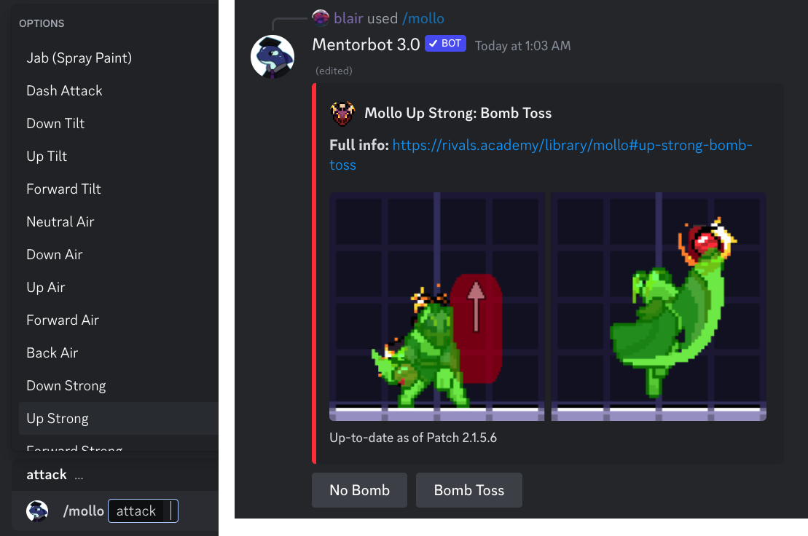
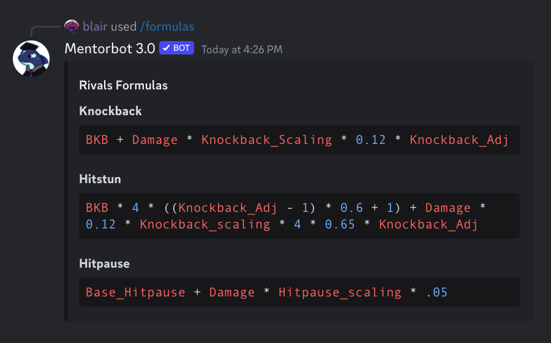
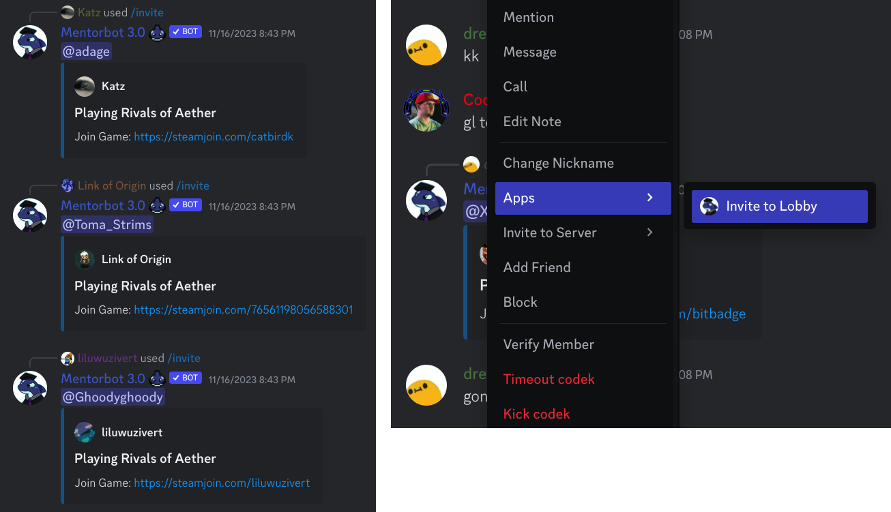
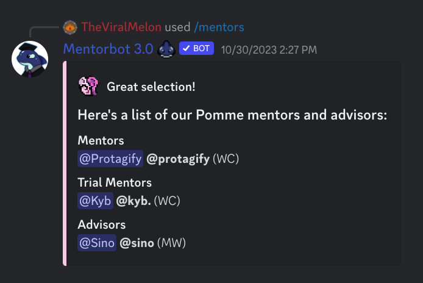
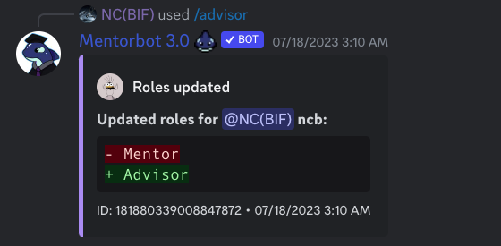

# Mentorbot 3.0

A custom Discord app by [Rivals Academy](https://rivals.academy), written with [discord.py](https://github.com/Rapptz/discord.py).

See Mentorbot in the [Rivals Academy Discord](https://rivals.academy/discord), the [Official Rivals of Aether Discord](https://discord.gg/roa), or [add to your own Discord server](https://discord.com/api/oauth2/authorize?client_id=475596740368793600&permissions=18432&scope=bot).

## Universal Features

### Hitbox Commands

Mentorbot's hitbox commands provide quick hitbox references for any move in the game, covering the movesets of all 18 characters.

### Informational Commands

Mentorbot includes a growing list of informational and reference commands, from in-game stats to competitive strategy guides.

### `/invite`
Created to drastically speed up the Steam matchmaking process, allowing users to seamlessly invite other members without leaving Discord. Uses Redis Database to persistently store links between users’ Discord and Steam accounts.

## Academy-Specific Features

### Mentor Commands

Character-based mentor commands list the Discord profiles of mentors, trial mentors, and advisors for that character.

#### Management

Mentors can manage how and when they appear on these commands through the `/advisor` and `/dnd` admin commands.

